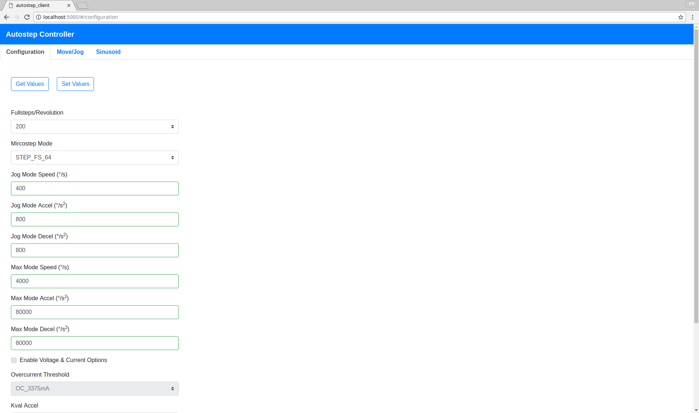
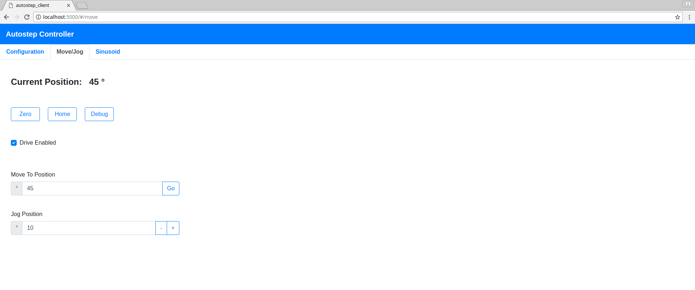
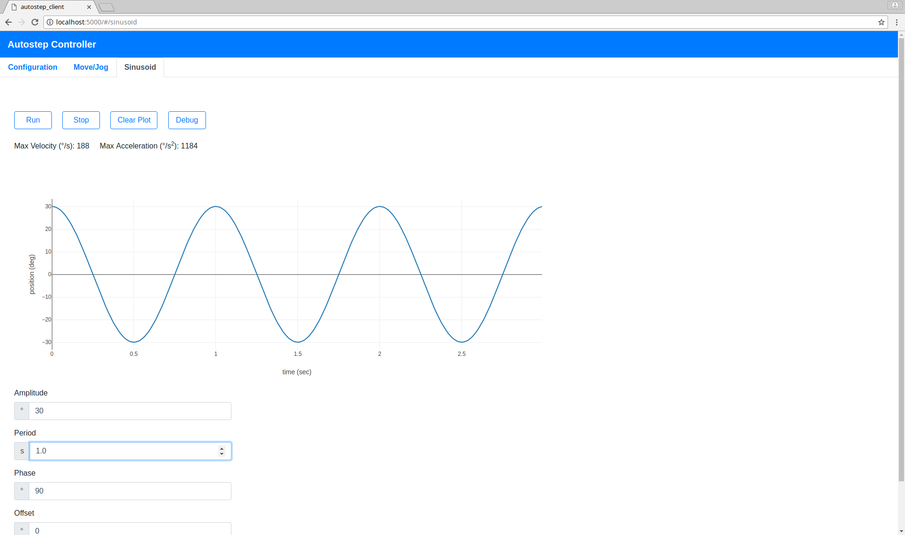

## Autostep 

Firmware + Python and Node.js libraries for controlling stepper motors via the
STMicro L6470 dSPIN stepper motor driver (e.g. Sparkfun Autodriver).  Can read
abosolute motor position via the EM3242 angle sensor. 

Includes includes methods for:  
* setting basic driver configuration i.e., microstepping, overcurrent threshold, etc.
* setting motion parameters, i.e.,  max velocity, acceleration, etc. 
* basic motor positioning, e.g,  motion point-to-point moves, run at fixed velocity, etc. 
* running sinusoidal trajectories, 

## Web App

### Configuration


### Move and Jog


### Sinusiodal Trajectories


<br>

## Firmware

* Location: "firmware/autostep" sub-directory
* Platform: teensy 3.2
* Install using Aruduino IDE w/ Teensduino Addon

## Python Library

* Location: "softare/python/autostep"
* Requirements: pyserial, numpy, matplotlib

### Installation


```bash
python setup.py install
```

## Javascript (Node.js) Library Installation

* Location: "software/node/autostep"

### Installation

```bash
npm install
```

## Javascript Web App server 

* Location: "software/node/web_app/autostep_server"

### Installation

```bash
npm install
```


## Javascript Web App server 

* Location: "software/node/web_app/autostep_client"

### Installation

```bash
npm install
```


